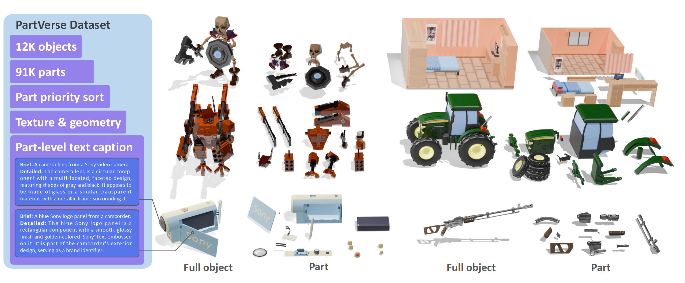
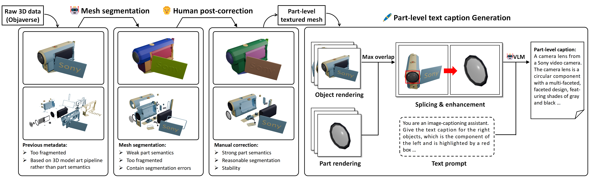
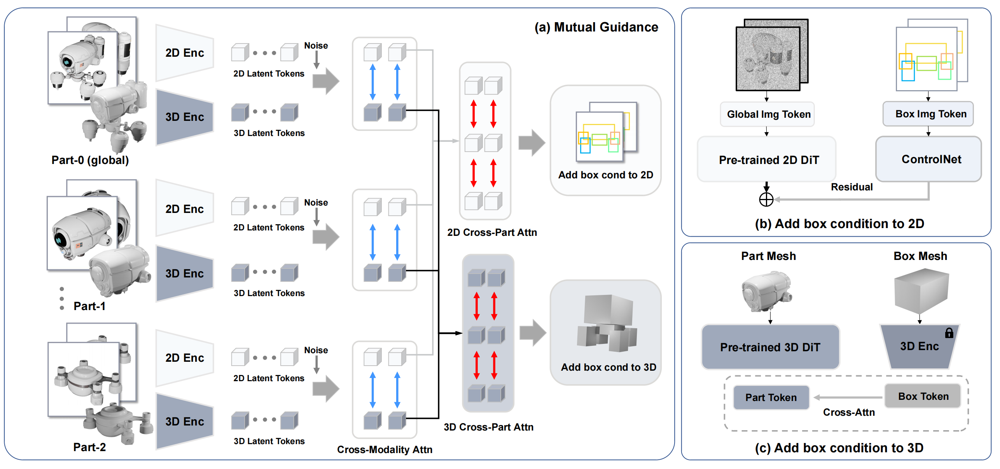

<div align="center">

# From One to More: Contextual Part Latents for 3D Generation (ICCV 2025)
## [arXiv Preprint](https://arxiv.org/) | [Project](https://hkdsc.github.io/project/copart/) | [Dataset](https://huggingface.co/) 

</div>

We present a new part-based 3D generation framework, *CoPart*, which represents a 3D object with multiple contextual part latents and simultaneously generates coherent 3D parts. And we are pleased to release the first large-scale 3D object part dataset *PartVerse* that has been manually annotated.




*We follow the pipeline of “raw data - mesh segment algorithm - human post correction -
generate text caption” to produce part-level data.*

<!-- 
*The framework of CoPart operates as follows: Gaussian noise is added to part image and geometric tokens extracted from the VAE, which are then fed into 3D and 2D denoisers. Mutual guidance (a) is introduced to facilitate information exchange between the 3D and 2D modalities (via Cross-Modality Attention) as well as between different parts (via Cross-Part Attention). Additionally, (b) the 3D bounding boxes are treated as cube meshes, and the extracted box tokens are injected into the 3D denoiser through cross-attention. Simultaneously, the boxes are rendered into 2D images and injected into the 2D denoiser via ControlNet.* -->

## Download & Usage
You can download the PartVerse dataset from [Google Drive](https://drive.google.com/drive/folders/11pl0yw-tjkYutPwpnv1ZeQvIEW7WkBSP) or [BaiduYun](https://drive.google.com/drive/folders/11pl0yw-tjkYutPwpnv1ZeQvIEW7WkBSP). 
The data directory after decompressing the dataset should be as follows:
```
dataset/
├── textured_part_glbs/  
├── normalized_glbs/    
├── anno_infos/    
└── text_captions.json       
```
- `textureld_part_glbs` contains textured 3D meshes for each decomposed part of the objects. Each file is stored in the GLB format.
- `normalized_glbs` provides the complete, normalized 3D mesh of each object in GLB format. These are aligned with the part-level meshes and can be used for holistic shape analysis or comparison.
- `anno_infos` provides files that can be used for generating auxiliary information of parts.
- `text_captions.json` stores descriptive text captions for each part, automatically generated using a Vision-Language Model (VLM).

Due to the large number of parts in some objects, we can discard some unimportant parts (such as a screw, etc.). We provide `partverse/get_infos.py` to process the data. By running it, you can obtain (1) some statistical information of the parts, (2) the priority of discarding them, (3) view of max overlap between full object and parts render. Please install [nvdiffrast](https://github.com/NVlabs/nvdiffrast) and [kaolin](https://github.com/NVIDIAGameWorks/kaolin) when use.
```
python partverse/get_infos.py --data_root ${DATA_PATH} --global_info_save_path ${SAVE_PATH} --max_visible_info_save_path ${SAVE_PATH}
```
We provide rendering script following [TRELLIS](https://github.com/microsoft/TRELLIS). You can use `partverse/render_parts.py` to render `textured_part_glbs` (part objects) and `partverse/render_dir.py` to render `normalized_glbs` (whole objects), e.g.,
```
python partverse/render_parts.py --textured_part_glbs_root ${PART_GLB_PATH} --out_dir ${OUT_PATH} --num_views 8 --elevation 30
```
In addition, we also provide text caption code to facilitate users in customizing text prompts for their own models. For the VLM, we use [Qwen2.5-VL-32B](https://huggingface.co/Qwen/Qwen2.5-VL-32B-Instruct) now. You can replace to any VLM.
```
python partverse/get_text_caption.py --raw_img_root ${FULL_OBJECT_IMG_PATH} --part_img_root ${PART_IMG_PATH} --info_file ${MAX_VIS_INFO_PATH} --output_file ${OUT_PATH} --vlm_ckpt_dir ${VLM_HF_DOWN_PATH}
```


## 🚩 News
- [2025/07/05] Our paper is accepted by ICCV 2025. Code is coming soon, stay tuned! 🔥

## 📖 Citation
```bibtex
@article{dong2025copart,
  title={From One to More: Contextual Part Latents for 3D Generation},
  author={Shaocong Dong, Lihe Ding, Xiao Chen, Yaokun Li, Yuxin WANG, Yucheng Wang, Qi WANG, Jaehyeok Kim, Chenjian Gao, Zhanpeng Huang, Zibin Wang, Tianfan Xue, Dan Xu},
  booktitle={ICCV},
  year={2025}
}
```
